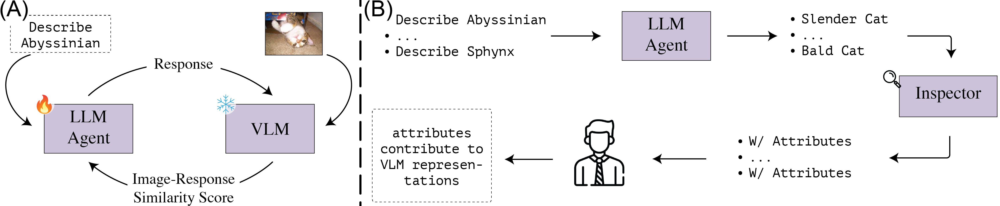

# Extract and Explore

Code for [If CLIP Could Talk: Understanding Vision-Language Model Representations Through Their Preferred Concept Descriptions](example.com)



## Setup

Install the following requirements:

```txt
accelerate==0.25.0
bitsandbytes==0.41.2.post2
datasets==2.15.0
open-clip-torch==2.23.0
peft==0.6.3.dev0
transformers==4.36.2
trl==0.7.5.dev0
vllm==0.2.7
torch==2.1.2
```

Follow the instructions in [this repo](https://github.com/BatsResearch/fudd/blob/main/Dataset_preparation.md) to prepare the datasets. Set the `DATA_ROOT` command line argument accordingly.

**Training:** to train the model, use `train_runner.sh` file.

To use [CLIP](https://huggingface.co/docs/transformers/model_doc/clip) or [ALIGN](https://huggingface.co/docs/transformers/en/model_doc/align) checkpoints, just pass the model name on Huggingface hub as the `vlm_name` argument. To use [OpenCLIP](https://github.com/mlfoundations/open_clip) models, set the `vlm_name` argument to `r-open-clip:MODEL:DATASET`, where `MODEL` is one of the models supported by OpenCLIP and `DATASET` is the pre-training dataset (e.g., `r-open-clip:ViT-bigG-14-CLIPA-336:datacomp1b`).

**Inference:** to generate the aligned descriptions, use `inference_runner.sh` file.
